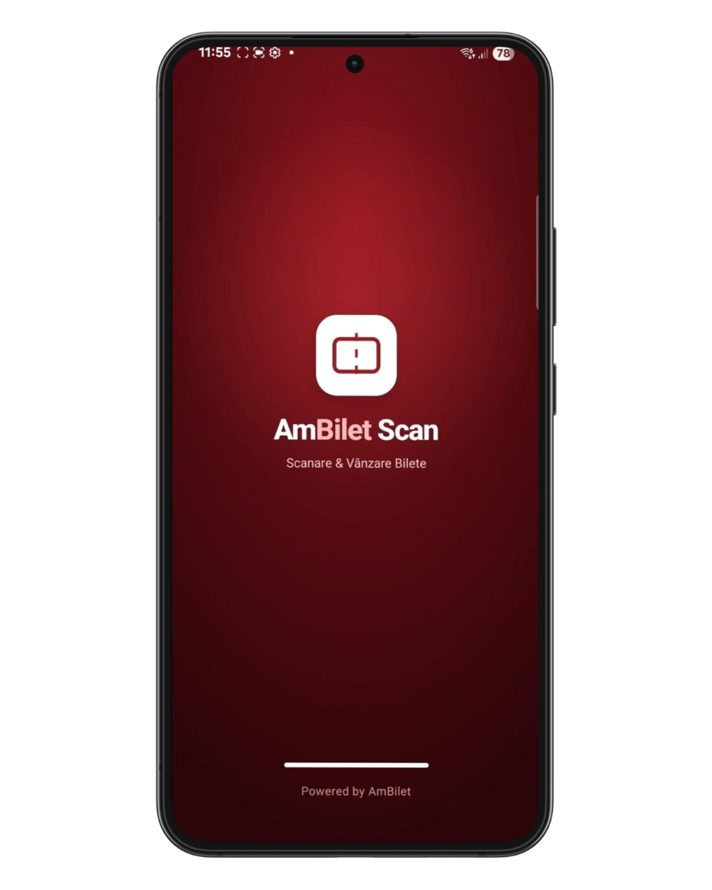
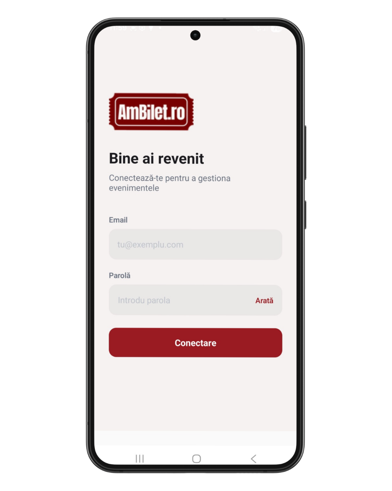
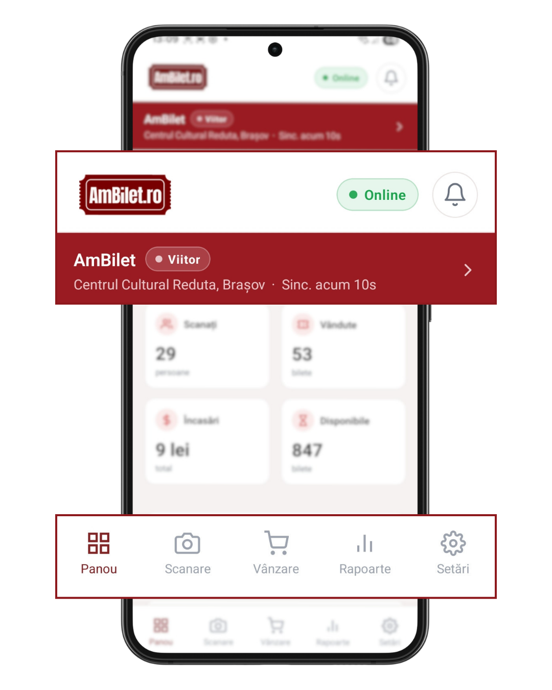

# Capitolul 1 — Bine ai venit

Ești pentru prima oară aici? Iată ce trebuie să știi ca să pornești.

Timp de citit: **~3 minute**.

---

## 1. Instalarea

Aplicația se numește **AmBilet** (sau **AmBilet** dacă testezi versiunea nouă). O găsești ca APK trimis pe email sau prin link WhatsApp de la echipa AmBilet.

**Cerințe minime**: Android 7+ / iOS 13+. Merge pe telefoane și tablete.

După instalare, deschide aplicația — vei vedea un scurt splash animat, apoi ecranul de login.

<!-- SCREENSHOT: splash screen animat cu efectul QR-scan + logo AmBilet -->

---

## 2. Login-ul

Folosește **emailul și parola** primite de la echipa AmBilet sau de la proprietarul contului (dacă ești staff angajat).

- Emailul e cel folosit în contul de organizator de pe web
- Parola e cea setată la primirea invitației (sau resetată de un admin)

<!-- SCREENSHOT: ecranul de login cu câmpuri email + parolă + buton Login -->

**Ai uitat parola?** Contactează proprietarul contului (owner) — poate reseta parola direct din aplicație, capitolul [16. Personal](./16_personal.md).

**Ești la mai mulți organizatori?** După login, dacă emailul tău e asociat la mai multe conturi, aplicația îți afișează un selector.
Detalii în [capitolul 28](./28_comutare_organizatori.md).

**La deschiderile următoare**, aplicația **completează automat email + parolă** din prima ta autentificare — apeși direct `Autentificare` și intri. Credentialele sunt criptate în telefon (SecureStore), nu se transmit nicăieri. Se șterg doar când apeși explicit *„Încheie Tura & Deconectare"* din Setări — util pentru predare de tură. 
Vezi [capitolul 23](./23_securitate.md) pentru detalii.

---

## 3. Prima privire asupra ecranului

După login intri direct pe **Panou**. Sus vezi 3 zone importante:

- **Antet** (header) — logo AmBilet, indicator Online/Offline, clopoțel notificări
- **Bara evenimentului** (roșu) — evenimentul curent selectat, tap pentru a schimba
- **Bara turei** (dacă tura e pornită) — cronometru + butoane pauză + urgență

Jos e **meniul principal** cu 5 tab-uri:

| Tab | Ce face |
|---|---|
| **Panou** | Cifrele-cheie ale evenimentului tău |
| **Scanare** | Verifică bilete la intrare |
| **Vânzare** | Vinzi bilete pe loc (cash / card) |
| **Rapoarte** | Statistici detaliate (doar admin) |
| **Setări** | Preferințe + admin |

<!-- SCREENSHOT: Panoul cu antet + bară eveniment roșu + meniu jos evidențiat -->

---

## 4. Ce trebuie să faci prima dată

**Pas 1**: verifică că ai selectat evenimentul corect (bara roșie de sus) → dacă nu, apasă și alege din listă. Detalii în [capitolul 3](./03_selectie_eveniment.md).

**Pas 2**: verifică că ești **Online** (pastilă verde în header). Dacă apare 🔴 **Offline**, ai probleme de semnal — dar aplicația merge oricum (vezi [capitolul 6 — vânzare offline](./06_vanzare_offline.md)).

**Pas 3**: dacă ești casier și pornești tura → apasă butonul de deschidere tură (detalii în [capitolul 21](./21_tura.md)).

**Pas 4**: gata, poți începe să lucrezi.

---

## 5. Ce vezi în header

Uită-te sus, mereu vizibil peste toate ecranele:

| Element | Ce înseamnă |
|---|---|
| Logo **AmBilet** | Doar branding |
| 🟢 **Online** | Ai internet, totul merge live |
| 🔴 **Offline** | Nu ai internet — dar aplicația funcționează |
| 🟡 **X în așteptare** | Ai vânzări/scanări nesincronizate ([cap. 6](./06_vanzare_offline.md)) |
| 🔔 Clopoțel + număr roșu | Notificări noi de citit (cap. 20) |

---

## 6. Ai probleme?

- **App-ul nu se deschide** → reboot telefon
- **Login refuză credentialele** → verifică că emailul e scris correct, cere reset de parolă
- **Nu văd niciun eveniment după login** → cere admin să te asocieze la organizator sau să publice un eveniment
- **Alt device și nu recunoaște parola** → contactează owner-ul organizatorului

Pentru probleme neacoperite: scrie-i echipei AmBilet la [contact standard].

---

## Următorul capitol

📖 [Capitolul 2 — Turul rapid al aplicației →](./02_tur_rapid.md)

📚 [Cuprins →](./00_cuprins.md)
