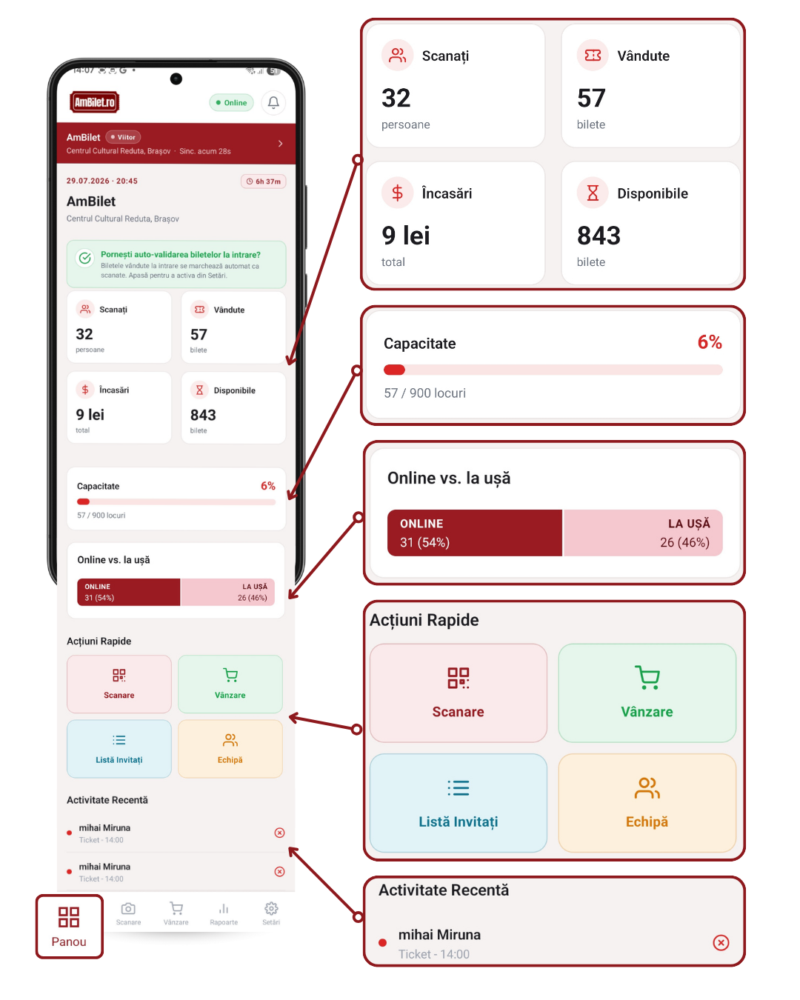
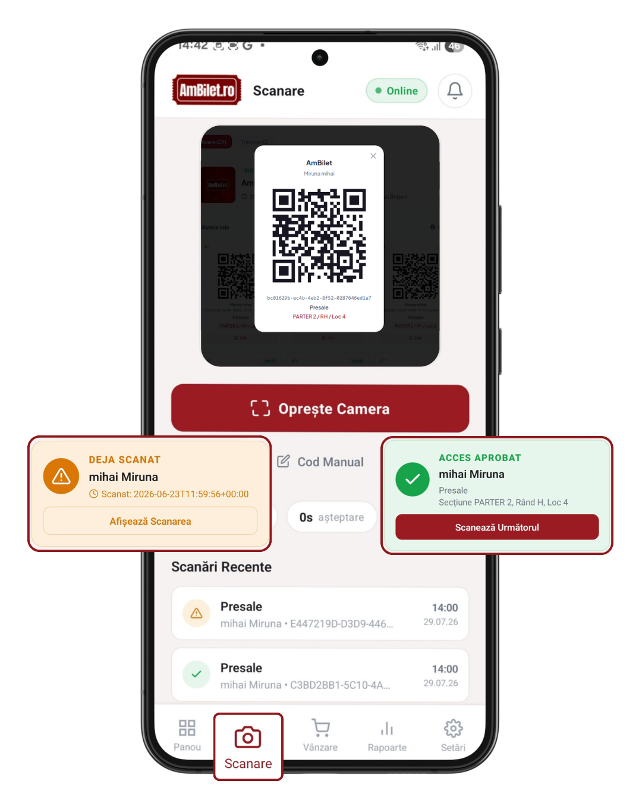
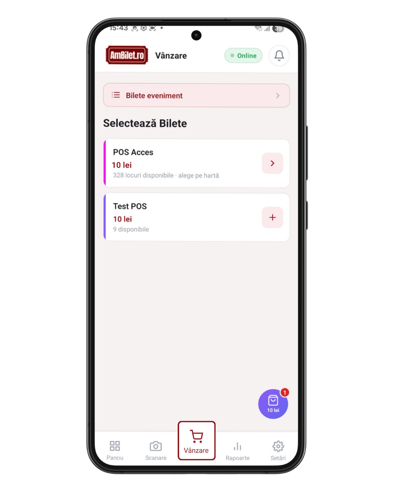
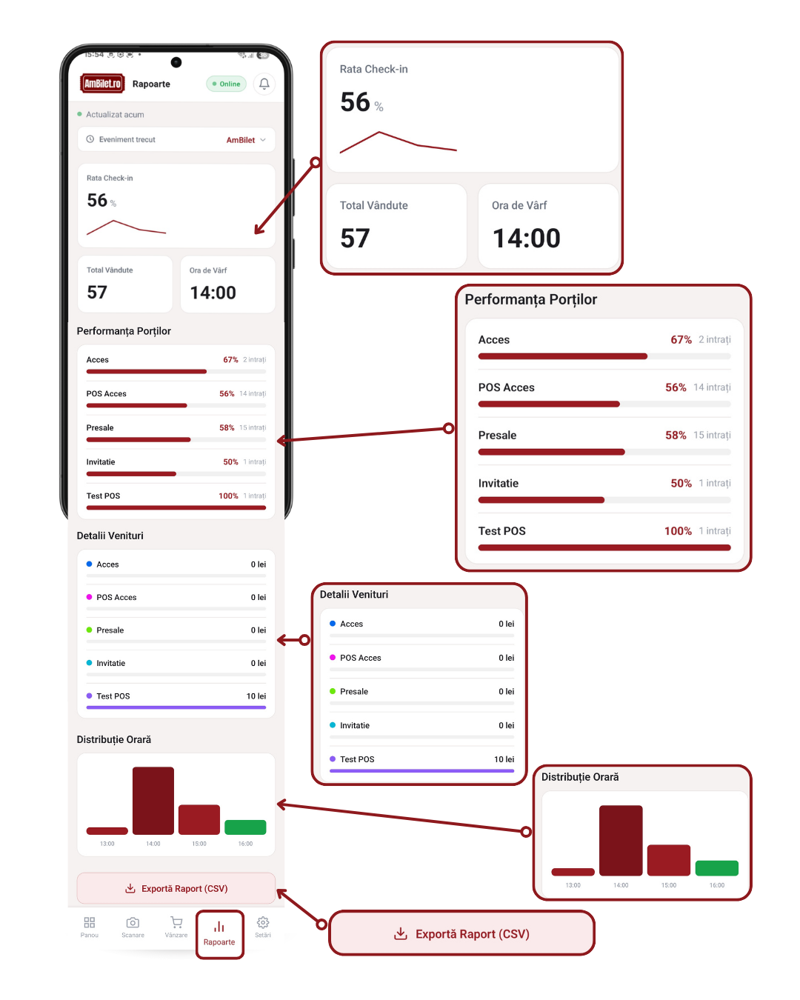
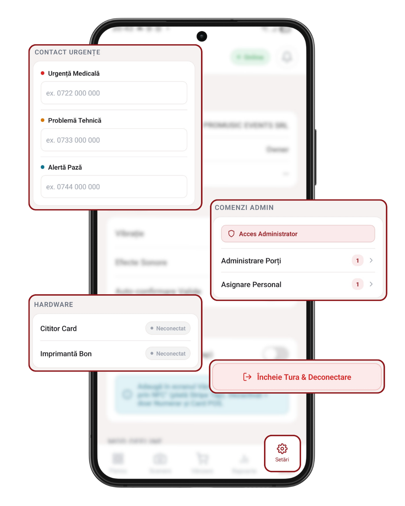

# Capitolul 2 — Turul rapid al aplicației

O plimbare de 5 minute prin toate ecranele — să știi ce e unde înainte să intri în detalii.

Timp de citit: **~5 minute**.

---

## 1. Panou — ce se întâmplă chiar acum

Primul tab, unde aterizezi după login. **Panoul e locul unde te uiți când vrei să știi „stăm bine?"**.

Ce vezi:
- **4 carduri mari**: Scanați / Vândute / Încasări / Disponibile
- **Capacitate** — bară de progres a evenimentului (câți oameni total au cumpărat vs. limita configurată)
- **Ritm vânzare** — bilete/minut cu direcție ↑↓
- **Online vs. la ușă** — câte bilete s-au vândut online vs. la casierie
- **Acțiuni rapide** — 4 shortcut-uri: Scanare, Vânzare, Listă Invitați, Echipă
- **Activitate recentă** — ultimele check-in-uri

<!-- SCREENSHOT: Panoul complet cu toate cardurile vizibile -->

**Fiecare card e clickabil** — tap deschide un modal cu detalii pe tipuri de bilete, break-down per gate, per sursă. Detalii în [capitolul 13](./13_panou_control.md).

---

## 2. Scanare — check-in la intrare

Al doilea tab. **Aici verifici biletele clienților** care intră la eveniment.

Ce vezi:
- **Cadru scanner** cu camera (când e activă)
- **Statistici mici**: câte scanări/minut, așteptare medie
- Butoane **Cod Manual** și **Pauzează**
- Sub cadru: **Scanări recente** — istoric ce ai scanat tu

<!-- SCREENSHOT: ecranul Scanare cu camera activă + statistici jos -->

Rezultatul unei scanări apare fullscreen scurt: **✅ APROBAT** (verde), **⚠️ DEJA SCANAT** (portocaliu) sau **❌ INVALID** (roșu).

Detalii în [capitolul 9](./09_scanare_camera.md) și [10](./10_scanare_manuala.md).

---

## 3. Vânzare — încasezi bilete pe loc

Al treilea tab. **POS-ul aplicației** — pentru vânzări la ușă, suplimentare de la standul de bilete etc.

Ce vezi:
- **Bara „Bilete eveniment"** sus — deschide istoricul complet
- **Grid cu tipurile de bilete** disponibile la vânzare
- Când adaugi în coș → jos apare **coșul** cu butoane +/− și `Continuă`

<!-- SCREENSHOT: ecranul Vânzare cu grid de tipuri de bilete + coș jos --> 

După ce apeși `Continuă`, intri în **modalul de plată**: Numerar / Card POS / Card NFC (dacă e activat).

Detalii în [capitolul 4](./04_vanzare_bilete.md).

---

## 4. Rapoarte — statistici detaliate

Al patrulea tab. **Vizibil doar pentru administratori** (proprietar, admin al organizatorului). Staff-ul normal nu-l vede.

Ce vezi:
- **Rata check-in** — procent + grafic sparkline pe ore
- **Total Vândute** + **Ora de Vârf**
- **Performanța Porților** — câte scanări per poartă
- **Detalii Venituri** — sume per tip de bilet
- **Distribuție Orară** — bară pe ore
- **Selector Eveniment Trecut** — vezi și rapoarte de evenimente încheiate
- Buton **Exportă Raport (CSV)**

<!-- SCREENSHOT: ecranul Rapoarte cu sparkline + cifre + secțiuni --> 

Detalii în [capitolul 15](./15_rapoarte.md).

---

## 5. Setări — preferințe & admin

Al cincilea tab. **Preferințe personale + comenzi admin**.

Ce vezi (secțiuni):
- **Cont** — nume, rol, poartă asignată
- **Scanner** — vibrație, sunet, auto-confirm
- **Vânzare POS** — activează Card NFC (admin only)
- **Mod Offline** — toggle manual + status
- **Hardware** — stare cititor card, imprimantă bon
- **Aspect** — teme Light / Contrast / Noapte
- **Securitate** — auto-logout după inactivitate
- **Contact Urgențe** — 3 numere pentru butoanele de urgență
- **Comenzi Admin** — Administrare Porți + Asignare Personal
- Buton **Logout** (roșu, jos)

<!-- SCREENSHOT: Setări cu secțiunile principale vizibile -->

Detalii în capitolele 16-25.

---

## 6. Zone speciale peste tab-uri

### Bara de tură (când e pornită)

Sus, sub header, apare o bară roșie cu cronometrul turei tale:
- **Cronometru** (00:34:12)
- Buton **Pauză**
- Buton **⚠️ Urgență** (roșu)

Vezi [capitolul 21](./21_tura.md).

### Selectorul de eveniment (roșu)

Pe Panou vezi mereu în partea de sus o **bară roșie** cu numele evenimentului activ. Tap pentru a schimba evenimentul selectat.

Vezi [capitolul 3](./03_selectie_eveniment.md).

### Panoul de notificări (clopoțel)

Tap pe clopoțelul din header → se deschide un panou cu:
- Ultimele notificări (check-in-uri, alerte, sync)
- Jos: **Raportează Problemă** cu 3 butoane apel rapid urgențe

Detalii în [capitolele 18](./18_raportare_urgente.md) și [20](./20_notificari.md).

---

## 7. Pentru staff cu venue (proprietari de sală)

Dacă lucrezi ca **venue owner** (proprietarul sălii/venue-ului), aplicația arată diferit:
- Tab-ul **Panou** e înlocuit cu **Evenimente** — lista tuturor evenimentelor din venue-ul tău
- Selectarea unui eveniment din listă te duce la un ecran de detaliu
- De acolo intri în Scanare sau Vânzare cu contextul acelui eveniment

Restul e similar.

---

## Următorul capitol

📖 [Capitolul 3 — Selectarea evenimentului →](./03_selectie_eveniment.md)

📚 [Cuprins →](./00_cuprins.md)
