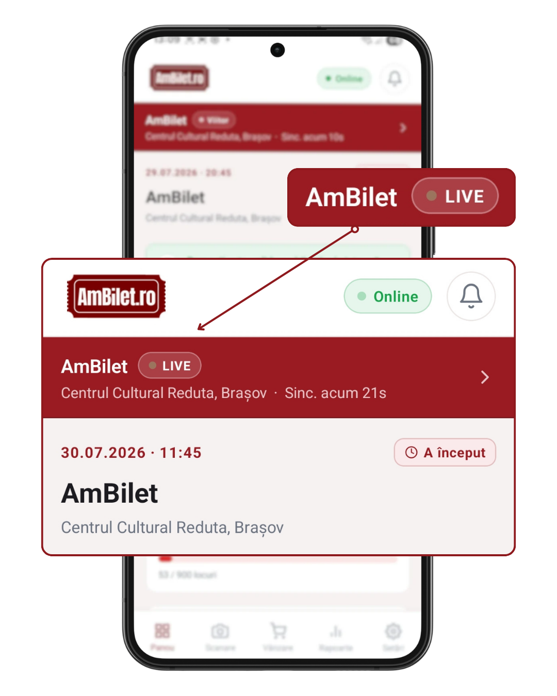
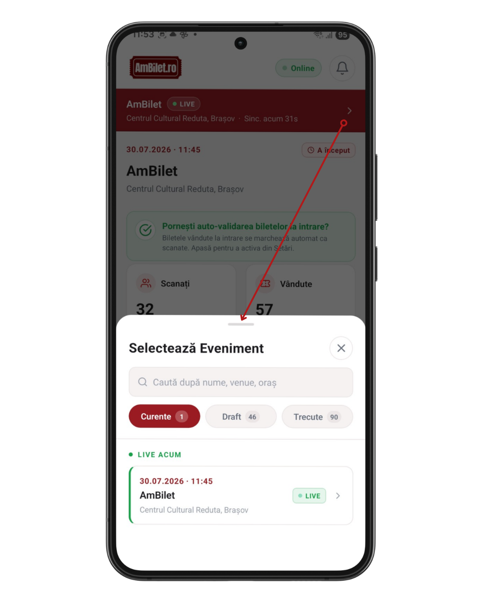
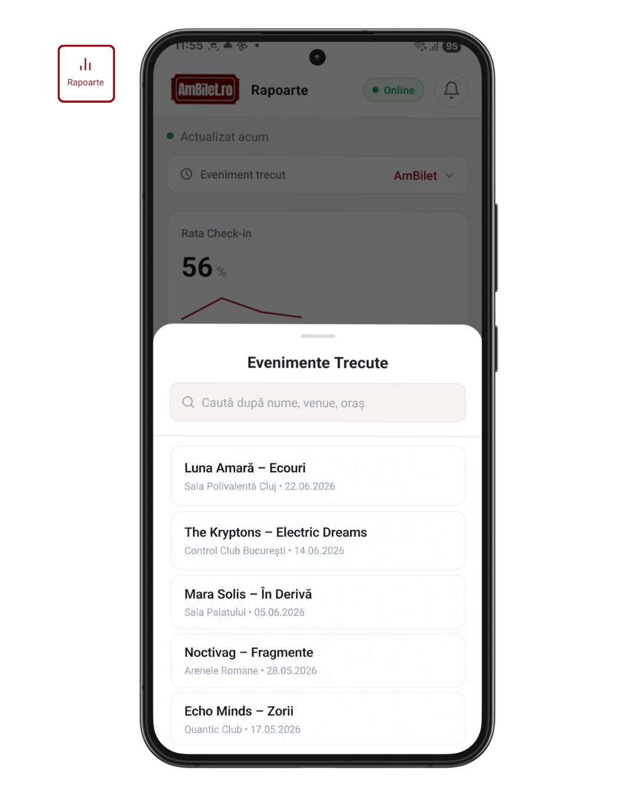

# Capitolul 3 — Selectarea evenimentului

Toate cifrele — vânzări, scanări, statistici — sunt legate de **un
singur eveniment selectat**. Iată cum îl schimbi.

Timp de citit: **~3 minute**.

---

## 1. Bara evenimentului (Panou)

Pe **Panou**, sus, imediat sub header, vezi o **bară roșie** cu:

- **Data scurtă** (ex. „15 Mar")
- **Numele evenimentului**
- **Locul** (venue + oraș)
- Un **badge de status**: 🟢 LIVE / Azi / Viitor / Încheiat / Nepublicat
- **Săgeată spre dreapta** — sugestie că e clickabilă

<!-- SCREENSHOT: bara roșie cu eveniment selectat + badge LIVE pulsat -->

**Tap oriunde pe bară** → se deschide selectorul de evenimente.

---

## 2. Selectorul de evenimente

Un modal sheet care alunecă de jos. **3 filtre** sus:

- **Curente** (default) — evenimente live, azi, în viitor
- **Draft** — evenimente nepublicate încă (draft, în revizuire, respinse)
- **Trecute** — evenimente încheiate

Fiecare filtru arată numărul de evenimente între paranteze.

**Sub filtre e o bară de căutare** — tastează numele evenimentului,
venue-ul sau orașul. Rezultatele se filtrează instant.

<!-- SCREENSHOT: modalul selector cu filtre Curente/Draft/Trecute + search -->

---

## 3. Categorii vizibile

Sub filtre, evenimentele apar grupate:

| Grup | Ce e | Când vezi |
|---|---|---|
| 🟢 **LIVE ACUM** | Eveniment în desfășurare chiar acum | Filtrul „Curente" |
| **AZI** | Eveniment care începe azi (dar nu încă) | Filtrul „Curente" |
| **VIITOARE** | Toate evenimentele viitoare | Filtrul „Curente" |
| 🟡 **NEPUBLICATE** | Draft, în revizuire sau respinse | Filtrul „Draft" |
| **EVENIMENTE TRECUTE** | Evenimente încheiate | Filtrul „Trecute" |

**Fiecare rând** arată:
- Data (dd.mm.yyyy · HH:MM)
- Numele evenimentului
- Locul (venue, oraș)
- Badge status
- Săgeata > la dreapta

Tap pe orice rând → **selecția se schimbă instant** și modalul se închide.

---

## 4. Refresh automat + manual

**Automat**: la fiecare deschidere a modalului, aplicația verifică
serverul pentru evenimente noi. Deci dacă tocmai ai publicat unul din
admin-ul web, îl vezi imediat aici.

**Manual**: trage-l în jos în listă (pull-to-refresh) → refresh cerut
explicit.

---

## 5. Ce se schimbă când selectezi alt eveniment

**Toate ecranele se resincronizează** automat:
- Panoul afișează cifrele noului eveniment
- Scanare setează contextul pe biletele acestui eveniment
- Vânzare arată tipurile de bilete configurate pentru el
- Rapoartele reîmprospătează statisticile

Nu trebuie să deconectezi și să reconectezi.

---

## 6. Auto-selecție inteligentă la login

După login, aplicația alege automat un eveniment activ după prioritate:

1. **LIVE** (dacă există) — evenimentul care se întâmplă chiar acum
2. **AZI** — eveniment programat pentru azi
3. **VIITOR** — cel mai apropiat viitor
4. **TRECUT** — cel mai recent încheiat
5. **Oricare** — dacă niciunul din categoriile de sus nu există

Deci de obicei aterizezi direct pe evenimentul potrivit.

---

## 7. Selectorul de eveniment trecut (în Rapoarte)

Rapoartele au **propriul selector** de „Eveniment trecut" — găsești
acolo lista evenimentelor încheiate cu bară de căutare.

<!-- SCREENSHOT: selector din Rapoarte cu evenimente trecute + search -->

Sortare: cele mai recente sus.

Detalii în [capitolul 15](./15_rapoarte.md).

---

## 8. Probleme frecvente

**„Nu văd un eveniment pe care tocmai l-am publicat"**
- Aplicația a cachat lista veche. Deschide selectorul (se refresh-uiește
  automat), sau trage-o în jos.
- Verifică că evenimentul e într-adevăr **publicat** (nu draft) în admin.

**„Văd doar drafturi, nu văd evenimentele live"**
- Ești pe filtrul greșit. Selectează **Curente**.

**„Am 100+ evenimente, nu găsesc unul anume"**
- Folosește **bara de căutare** — tastează 2-3 litere din nume, venue
  sau oraș, se filtrează instant.

**„Am schimbat evenimentul, dar cifrele arată tot pe cel vechi"**
- Trage Panoul în jos (pull-to-refresh)
- Sau ieși și intri pe tab

---

## 9. Testează pe viu

1. [**Deschide Panoul →**](app://navigate/Dashboard)
2. Tap pe bara roșie cu evenimentul curent
3. Comută între **Curente / Draft / Trecute** — vezi cum se schimbă lista
4. Tastează 3 litere în bara de căutare — vezi filtrarea
5. Tap pe alt eveniment → observă cum se schimbă tot Panoul

---

## Următorul capitol

📖 [Capitolul 4 — Vânzarea normală →](./04_vanzare_bilete.md)

📚 [Cuprins →](./00_cuprins.md)
