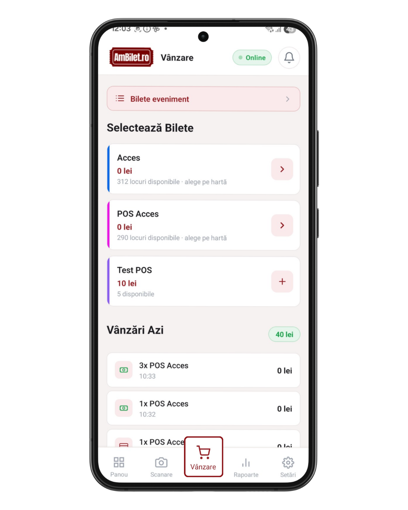
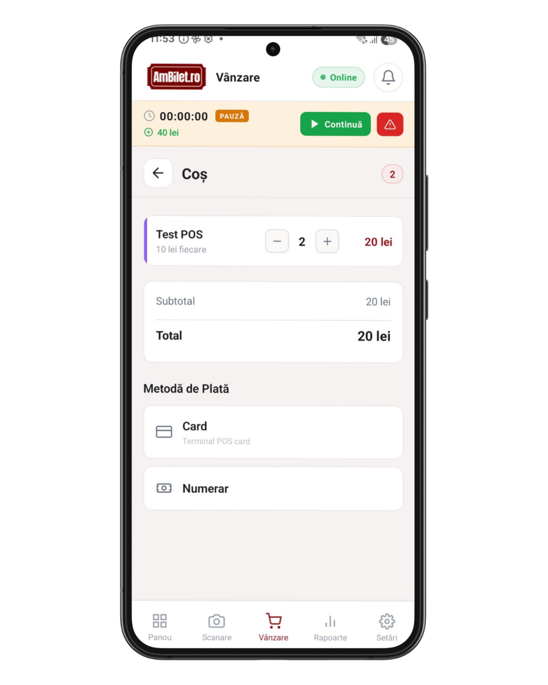
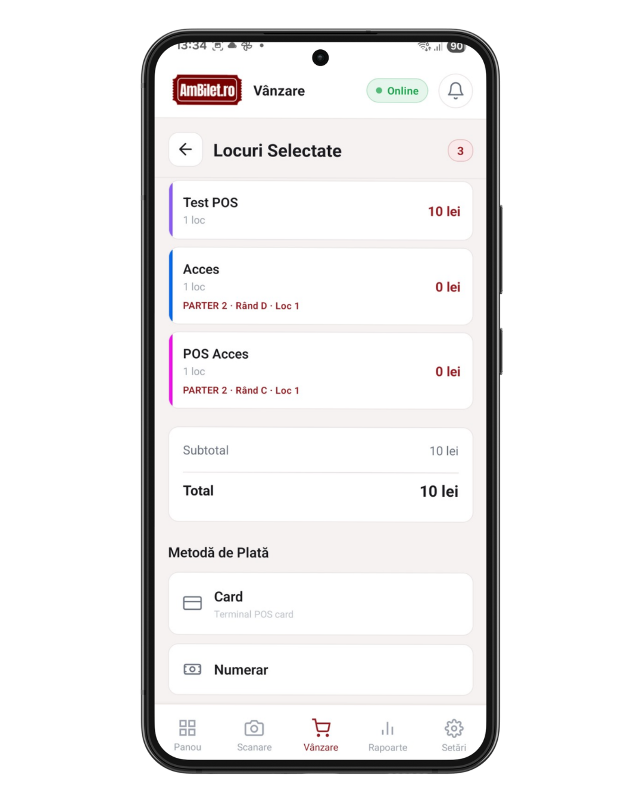
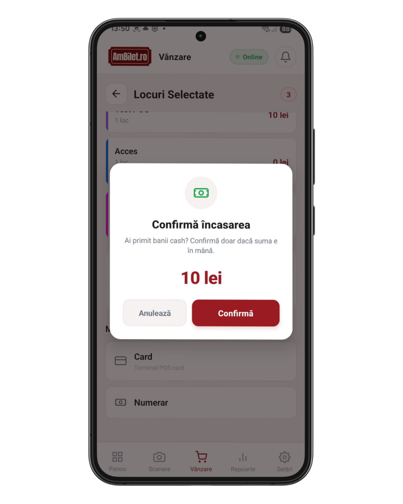
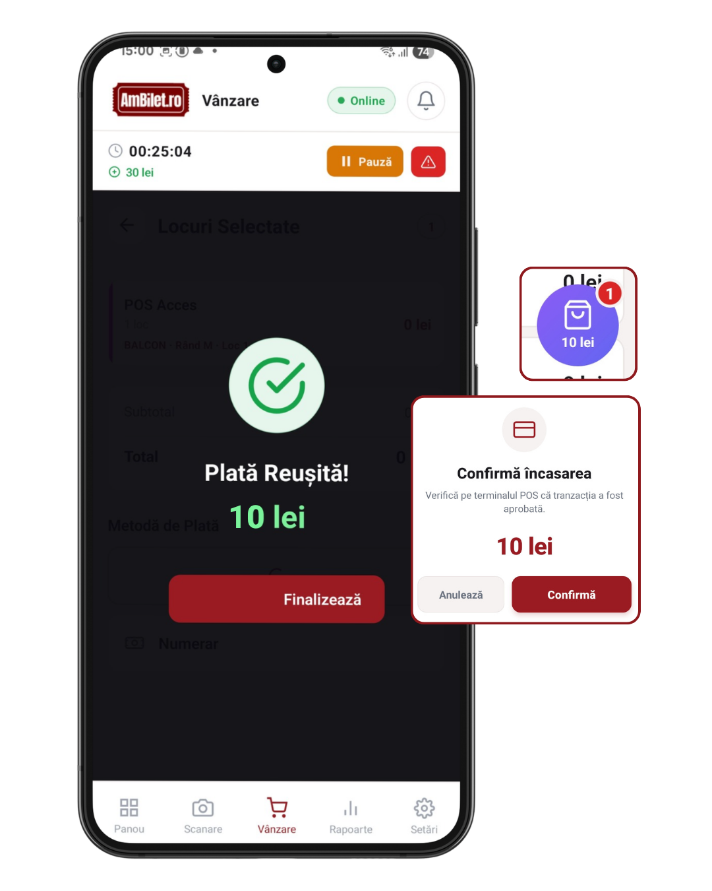
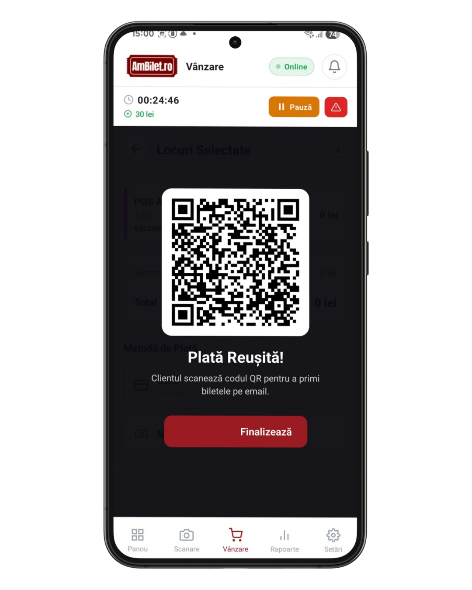
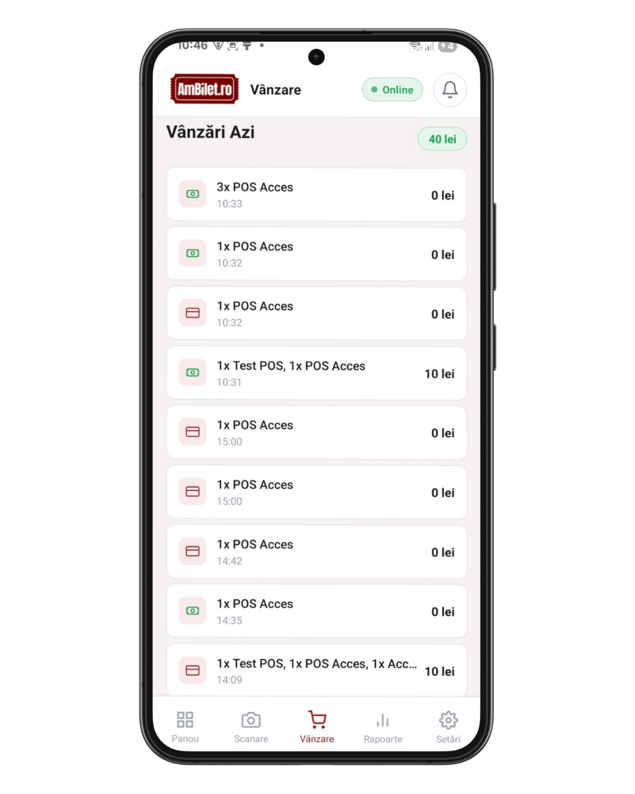

# Capitolul 4 — Vânzarea normală de bilete

Fluxul standard pentru vânzarea la ușă. Cash, card POS extern, card
prin NFC (Stripe Tap). Pentru evenimente **fără locuri asignate**
(bilete generale). Pentru evenimente cu locuri, vezi
[capitolul 5](./05_vanzare_locuri.md).

Timp de citit: **~5 minute**.

---

## 1. Deschide tab-ul Vânzare

Din meniul de jos, apasă **Vânzare**. Vezi:

- Sus, **„Bilete eveniment"** — link către istoricul biletelor vândute la
  acest eveniment (vezi [capitolul 7](./07_bilete_eveniment.md))
- Titlul **„Selectează Bilete"**
- **Grid cu tipurile de bilete** disponibile (cardurile cu preț)

<!-- SCREENSHOT: ecran Vânzare cu grid de tipuri de bilete + coș gol -->

---

## 2. Fiecare card de bilet

Un card conține:
- **Bandă colorată** stânga (identifică tipul)
- **Numele biletului** (ex. „General", „VIP")
- **Prețul** (ex. „150 RON")
- **Descriere** (opțional)
- **Disponibile: X** (câte mai sunt pe stoc)
- Buton `+` (dreapta) — adaugă în coș

Dacă biletul e **sold out**, cardul e dezactivat cu mesajul „Epuizat".

---

## 3. Adaugă în coș

**Tap pe cardul dorit** sau pe `+` → biletul intră în coș.

Repetă pentru mai multe bilete de același tip sau tipuri diferite.

Sub grid apare **coșul** cu:
- Fiecare tip: nume, preț unitar, cantitate, subtotal
- Butoane − / + pentru cantitate
- Butoane pentru șterge (dacă vrei să scoți)
- **Total** jos + buton `Continuă →`

<!-- SCREENSHOT: Vânzare cu 3 bilete diferite în coș + total vizibil -->

**Comisioane**: dacă evenimentul are comisioane per bilet, ele apar sub
total (informativ, nu se schimbă).

---

## 4. Continuă spre plată

Apasă `Continuă →`. Intri în **modalul „Locuri Selectate" / „Coș"** cu:

- Lista biletelor
- **Total mare** (roșu)
- Secțiunea **„Metodă de Plată"** cu până la 3 butoane:
  - **Card POS** — folosești terminal card fizic
  - **Numerar** — încasezi cash direct
  - **Card prin NFC** (Stripe Tap) — dacă e activat de organizator

<!-- SCREENSHOT: coș extins cu total mare + 3 butoane metodă de plată -->

---

## 5. Metoda 1: Numerar

**Tap pe `Numerar`** → apare un modal de **confirmare**:

- Iconă mare cu bancnote verzi
- „**Confirmă încasarea**"
- Descriere: „Ai primit banii cash? Confirmă doar dacă suma e în mână."
- **Suma mare, în roșu**
- 2 butoane: `Anulează` și `Confirmă`

<!-- SCREENSHOT: modal confirmare cash cu bancnote verzi + suma roșie -->

- `Confirmă` → înregistrează vânzarea, biletele se emit
- `Anulează` → coșul se **golește complet** (protecție împotriva
  vânzărilor greșite: e ca „reset" total la casă)

---

## 6. Metoda 2: Card POS extern

**Tap pe `Card POS`** → apare **același modal** de confirmare, dar
adaptat:

- Iconă cu card violet
- „**Confirmă încasarea**"
- Descriere: „Verifică pe terminalul POS că tranzacția a fost aprobată."
- Suma + `Anulează` / `Confirmă`

<!-- SCREENSHOT: modal confirmare card cu card violet + text POS -->

**Fluxul real**:
1. Tastezi suma pe terminalul POS al băncii (cel fizic)
2. Clientul dă cardul
3. Aștepți „aprobată" pe terminal
4. **Apoi** apeși `Confirmă` în aplicație
5. Biletele se emit

Dacă tranzacția pe POS e refuzată → apasă `Anulează`, coșul se șterge.

---

## 7. Metoda 3: Card prin NFC (Stripe Tap)

**Doar dacă e activat** din Setări → „Card prin NFC" (admin only). Când
e activ, apare un al treilea buton `Card prin NFC` cu subtitlul
„Furnizat de Stripe".

**Cum funcționează**:
1. Tap pe `Card prin NFC`
2. Aplicația **inițiază tranzacția Stripe** direct
3. Ecranul îți spune să apropii cardul de telefon (contactless)
4. Clientul își pune cardul sau telefonul cu Apple/Google Pay lângă spatele telefonului tău
5. Stripe autorizează → biletele se emit

**Cerințe**:
- Internet activ (nu merge offline)
- Telefonul are NFC
- Organizatorul a configurat Stripe în cont

---

## 8. Ecranul de succes

După confirmare, apare **overlay-ul verde „Plată Reușită!"** cu:

- Bifă mare verde
- Suma încasată în verde deschis
- Buton `Finalizează`

Dacă evenimentul are **claim URL**, apare și un **cod QR** — clientul îl
scanează cu telefonul lui și primește biletele pe email direct.

<!-- SCREENSHOT: ecran verde Plată Reușită cu QR + sumă mare -->

**Alt buton opțional**: `Trimite pe email` — introduci emailul
clientului și biletele merg direct pe adresa lui.

Tap `Finalizează` → te întorci la Vânzare, gata pentru următorul client.

---

## 9. Vânzări azi — secțiunea inferioară

Sub grid, dacă ai vândut deja azi, apare o secțiune **„Vânzări Azi"**:

- Total încasat azi (sus, verde)
- Listă cu ultimele vânzări: metodă, sumă, tipul biletului
- Tap pe o vânzare → poți revedea QR-ul

Util să vezi rapid „azi am făcut 3500 lei".

<!-- SCREENSHOT: secțiune Vânzări Azi cu total sus + listă -->

---

## 10. Butonul de coș plutitor (FAB)

Dacă ești pe grid-ul de bilete și **ai deja bilete în coș**, jos-dreapta
apare un **buton rotund roșu cu numărul** de bilete. Tap → sari direct
la vederea Coș.

Vederea coș are săgeată `←` sus-stânga pentru a te întoarce la grid.

---

## 11. Limitări

- **Fără internet**: doar Numerar și Card POS. NFC nu merge offline
  ([cap. 6](./06_vanzare_offline.md))
- **Comisioane**: se calculează server-side, nu se pot modifica din app
- **Discount / cupoane**: nu sunt disponibile în POS mobil (doar pe website)
- **Refund**: se face din admin web, nu din aplicație

---

## 12. Probleme frecvente

**„Butonul Numerar/Card e gri, nu răspunde"**
- Ești în tură? Anumite roluri necesită tură pornită.
- Ai internet slab? Poți da retry sau ieși din modal și reintri.

**„Am confirmat cash din greșeală, cum anulez?"**
- Vânzarea e deja înregistrată. Refund se face din **admin web** de către
  proprietar.
- Pentru viitor: folosește `Anulează` **înainte** de a apăsa Confirmă.

**„Clientul nu a primit QR-ul pe email"**
- Ai introdus email corect? Verifică spam-ul clientului.
- Dacă era offline: se trimite după sync. Verifică pastila galbenă din
  header ([cap. 6](./06_vanzare_offline.md)).

**„Terminalul POS a aprobat dar am uitat să apăs Confirmă"**
- Nu e o problemă. Bani sunt pe card, dar bilete NU s-au emis.
- Refă vânzarea în aplicație și confirmă când vine următorul client.
- Contactează admin să șteargă tranzacția extra din POS-ul băncii.

---

## 13. Testează pe viu

1. [**Deschide Vânzare →**](app://navigate/Sales)
2. Selectează un tip de bilet, adaugă în coș
3. Apasă `Continuă →`
4. Verifică modalul de plată — vezi cele 2-3 metode
5. Tap pe `Numerar` → observă modalul de confirmare cu sumă vizibilă
6. Apasă `Anulează` → coșul se golește complet
7. Repetă cu `Card POS` — același flux, text ușor diferit

---

## Următorul capitol

📖 [Capitolul 5 — Vânzarea cu locuri (seating) →](./05_vanzare_locuri.md)

📚 [Cuprins →](./00_cuprins.md)
