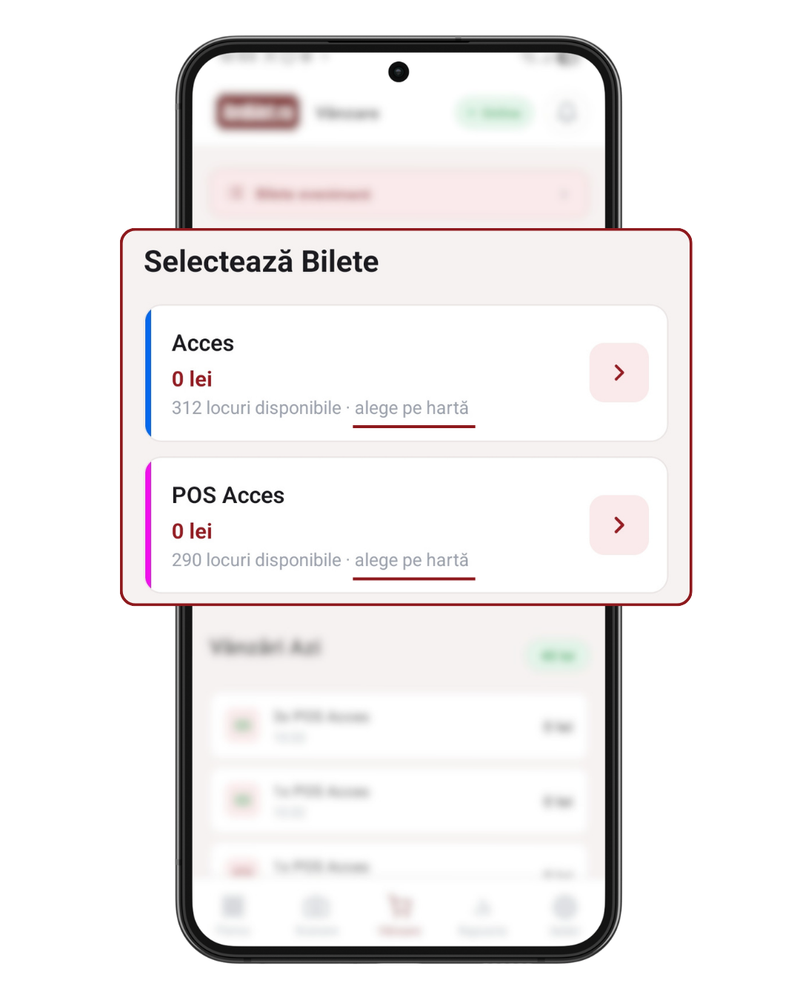
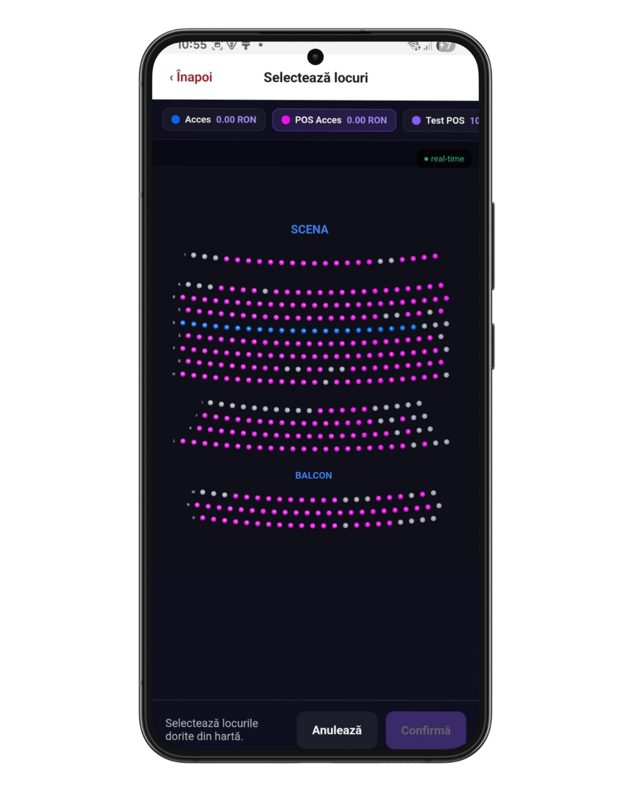
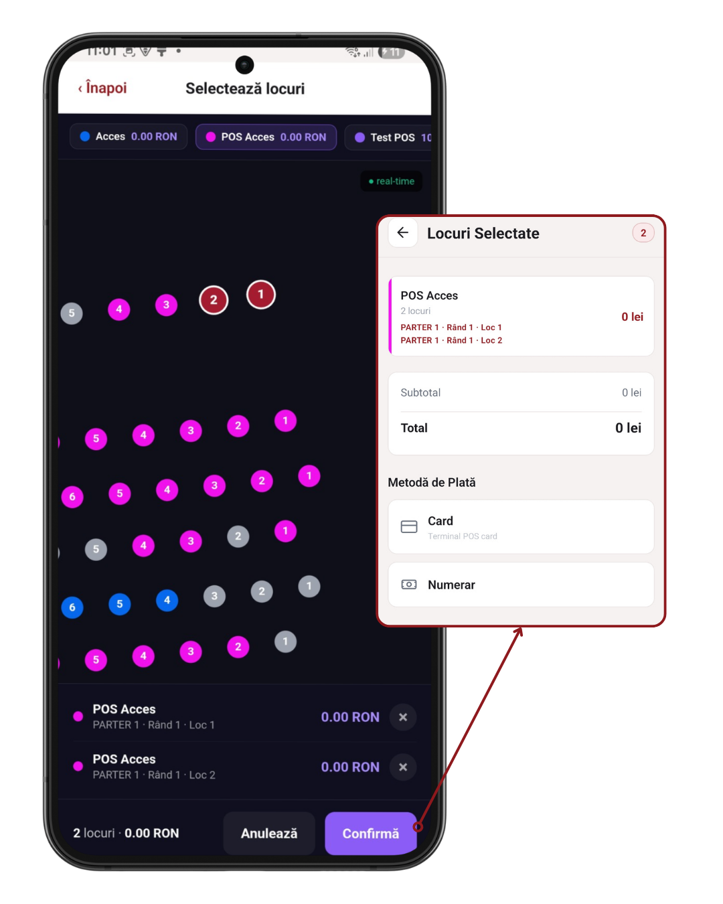

# Capitolul 5 — Vânzarea cu locuri (seating)

Pentru evenimente unde biletele sunt **legate de un loc specific** (scaun, rând, secțiune) — concerte în sală, teatre, arene. Fluxul e ușor diferit față de vânzarea normală.

Timp de citit: **~4 minute**.

---

## 1. Cum îți dai seama că evenimentul are locuri

În ecranul **Vânzare**, cardul de bilet arată:

- În loc de „Disponibile: X", vezi **„X locuri disponibile · alege pe hartă"**
- Butonul `+` are **săgeată →** în loc de plus (semnal că se deschide o hartă)

<!-- SCREENSHOT: card tip bilet cu locuri disponibile + săgeată → -->

Dacă biletul nu are locuri, e vânzare normală ([cap. 4](./04_vanzare_bilete.md)).

---

## 2. Deschide harta locurilor

**Tap pe cardul cu locuri** → se deschide **harta interactivă** a sălii, plin ecran:

- Secțiuni, rânduri, scaune desenate ca puncte
- **nuante bilete** = disponibil, **gri** = deja vândut, **roșu** = blocat/rezervat
- **Zoom cu 2 degete**, pan cu un deget
- Sus e **legenda** cu prețuri per zonă

<!-- SCREENSHOT: harta locurilor cu secțiuni + legenda de prețuri -->

---

## 3. Selectează locuri

**Tap pe un scaun verde** → devine roșu (selectat) și apare într-un **mini-coș** jos:

- Secțiunea (ex. „Balcon Central")
- Rândul (ex. „Rând 3")
- Locul (ex. „Loc 12")
- Prețul

Poți selecta **mai multe locuri** — se adună toate în același coș, cu suma totală actualizată live.

**Tap pe un loc deja selectat** → îl deselectezi.

<!-- SCREENSHOT: hartă cu 3 locuri selectate + mini-coș jos cu detalii -->

Butonul `Confirmă X locuri` jos → merge la coș final.

---

## 4. Coșul cu locuri

După confirmare, revii în ecranul de vânzare în vederea **„Locuri Selectate"**:

- Titlu clar: **„Locuri Selectate"** (nu „Coș")
- Lista: fiecare loc cu **Secțiunea · Rând · Loc**
- Butoanele +/- **nu sunt disponibile** (nu poți schimba cantitate — un loc = un bilet)
- Poți doar **anula** un loc dacă vrei să-l scoți

Sub listă apar metodele de plată — Numerar, Card POS, Card NFC — la fel ca la [vânzarea normală](./04_vanzare_bilete.md).

---

## 5. Butonul înapoi (special pentru seating)

Săgeata `←` din stânga sus (când ești pe „Locuri Selectate") se comport diferit față de vânzarea normală:

- **Prima apăsare** → te duce înapoi în **harta locurilor** (poți allege alte locuri sau schimba selecția)
- **Nu golește** coșul până când te întorci la grid-ul de bilete

Așa poți jongla între hartă și coș fără să pierzi selecția.

---

## 6. Plata

Identică cu [capitolul 4](./04_vanzare_bilete.md) — Numerar / Card POS / Card NFC. Confirmare cu modal, aceleași reguli.

**Diferență importantă la Anulează**: dacă apeși `Anulează` din modalul de confirmare, coșul se golește **și** locurile se eliberează instant în hartă (redevin verzi).

---

## 7. Ecranul de succes

Similar cu vânzarea normală. **Bilet cu loc pe QR / email** — clientul primește un bilet cu **Secțiunea, Rândul și Locul** menționate explicit.

---

## 8. Multiple tipuri de bilete + locuri mixte

Poți combina:
- 2 bilete **VIP la loc** (selectate din hartă)
- 3 bilete **General fără loc** (adăugate din grid)

Toate merg în același coș. Vederea „Locuri Selectate" arată **AMBELE** tipuri, cu detaliile potrivite pentru fiecare (loc pentru cele seated, cantitate pentru cele generale).

---

## 9. Limitări

- **Fără internet**: harta locurilor **NU** se poate încărca. Selecția de locuri necesită sync live cu serverul pentru a evita conflictele
  („doi casieri vând același loc simultan"). Locurile nu merg offline.
- **Timp de hold**: după ce selectezi un loc, este **rezervat pentru tine 10 minute**. Dacă nu finalizezi plata în 10 minute, se eliberează automat.
- **Un loc = un bilet**: nu poți vinde „2x locul X".

---

## 10. Probleme frecvente

**„Harta locurilor nu se încarcă"**
- Verifică internetul. Locurile necesită conexiune live.
- Trage ecranul în jos (pull-to-refresh) sau ieși și reintri pe tab.

**„Am selectat un loc, dar apoi apare gri (deja vândut)"**
- Alt casier de la altă casă tocmai l-a vândut. Locul nu mai e al tău.
- Alege alt loc.

**„Selecția mi-a expirat"**
- Ai depășit 10 minute între selectarea locului și confirmarea plății.
- Selectează din nou din hartă.

**„Vreau să schimb un loc cu altul"**
- Deschide harta din nou (tap pe cardul de tip bilet)
- Deselectează locul vechi (tap pe el roșu)
- Selectează altul verde
- Confirmă

---

## 11. Testează pe viu

Doar dacă ai un eveniment cu locuri asignate.

1. [**Deschide Vânzare →**](app://navigate/Sales)
2. Caută un card cu „X locuri disponibile · alege pe hartă"
3. Tap → se deschide harta
4. Selectează 2 locuri (tap pe puncte verzi)
5. Verifică mini-coșul jos cu totalul
6. Confirmă → intri în „Locuri Selectate"
7. Continuă cu Anulează pentru a NU vinde real (dacă e test)

---

## Următorul capitol

📖 [Capitolul 6 — Vânzarea fără internet →](./06_vanzare_offline.md)

📚 [Cuprins →](./00_cuprins.md)
