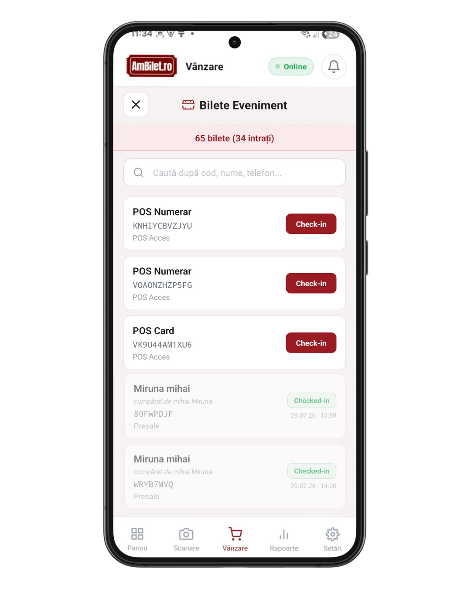

# Capitolul 7 — Bilete Eveniment (istoric vânzări)

Vezi și verifici **toate** biletele vândute la evenimentul curent, în timp real. Util pentru: căutare rapidă, check-in manual, verificare status.

Timp de citit: **~3 minute**.

---

## 1. Cum ajungi la Bilete Eveniment

Din tab-ul **Vânzare**, sus, apasă pe bara **„Bilete eveniment"**:

<!-- SCREENSHOT: bara Bilete Eveniment în ecran Vânzare, cu iconă listă -->


Se deschide un ecran plin cu **lista tuturor biletelor** — vândute online + la ușă + invitații.

---

## 2. Ce vezi în listă

Fiecare bilet e un card cu:

- **Numele beneficiarului** (dacă e diferit de cumpărător, apare și el)
- **Codul biletului** (ex. `ABC123`)
- **Tipul biletului** (ex. „General", „VIP")
- Un **badge de status** dreapta:
  - 🟢 **Checked-in** — deja intrat, cu data + ora sub badge
  - 🟡 **Nevalidat** — încă nu a intrat
  - 🔴 **Invalid** — anulat / refunded
- Un **buton `Check-in`** roșu (dacă biletul nu e validat)

---

## 3. Data + ora check-in-ului

Sub badge-ul verde **„Checked-in"**, dacă biletul a fost deja validat, vezi **când**:

```
Checked-in
20.07.26 · 14:32
```

Util pentru:
- Verificat dacă cineva „chiar a intrat" acum sau ieri
- Detectat scanări dubioase (bilet scanat la 3 dimineața?)
- Audit după eveniment

---

## 4. Check-in manual din listă

Dacă un client vine la tine cu problema **„nu funcționează codul meu"**:

1. Deschide Bilete Eveniment
2. Caută-l după nume/cod (secțiunea următoare)
3. Verifică că badge-ul e 🟡 „Nevalidat"
4. Apasă butonul **`Check-in`** din dreapta cardului
5. Biletul se validează instant, badge devine 🟢

**Alternative**: poți face același lucru din ecranul Scanare cu căutarea după nume ([cap. 10](./10_scanare_manuala.md)).

---

## 5. Statistici sus

În partea de sus a ecranului vezi:

- **Total bilete**: câte s-au vândut la eveniment
- **Checked-in**: câte au intrat efectiv

---

## 6. Refresh + pull-to-refresh

Trage lista în jos → se reîncarcă cu ultimele vânzări.

Aplicația face refresh automat la fiecare 30 secunde când e deschis ecranul.

---

## 7. Buton X (închide)

Sus-stânga, un buton `×` te întoarce la ecranul de Vânzare.

---

## 8. Limitări

- **Fără internet**: lista nu se poate încărca live. Vezi doar ce s-a cachat anterior.
- **Bilete anulate / refunded**: apar cu badge roșu „Invalid", NU pot fi check-in-uite
- **Bilete de test** (Test POS): apar cu ștampila TEST vizibilă, dar altfel funcționează la fel

---

## 9. Probleme frecvente

**„Nu văd un bilet vândut de mine acum 2 minute"**
- Verifică că **evenimentul selectat** e corect
- Trage lista în jos (pull-to-refresh)
- Cache 30s poate întârzia — așteaptă puțin

**„Butonul Check-in nu răspunde"**
- Verifică internetul
- Verifică că biletul nu e deja checked-in (badge verde) sau invalid

**„Vreau să văd bilete de la un alt eveniment"**
- Închide ecranul → schimbă evenimentul din bara roșie ([cap. 3](./03_selectie_eveniment.md))
- Redeschide Bilete Eveniment

---

## 10. Testează pe viu

1. [**Deschide Vânzare →**](app://navigate/Sales)
2. Apasă pe bara „Bilete eveniment" din sus
3. Vezi lista tuturor biletelor
4. Uită-te la un bilet 🟢 checked-in — observă data + ora sub badge
5. Găsește un bilet 🟡 Nevalidat, apasă `Check-in` → devine 🟢
6. Închide cu `×`

---

## Următorul capitol

📖 [Capitolul 8 — Bilete de test (Test POS) →](./08_bilete_test.md)

📚 [Cuprins →](./00_cuprins.md)
