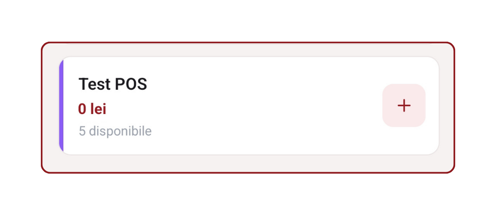

# Capitolul 8 — Bilete de test (Test POS)

Vinzi și scanezi bilete **de probă**, fără să afectezi cifrele reale ale evenimentului. Util pentru instruirea personalului, verificarea imprimantei, testarea unei configurații noi.

Timp de citit: **~2 minute**.

---

## 1. Ce e un bilet de test

Un tip special de bilet, marcat cu **`TEST`** (violet) în interfață, care:

- Are preț 0 (nu implică bani reali)
- **NU** apare în statistici de vânzări
- **NU** afectează totalurile turei / rapoartele
- **NU** intră în capacitatea evenimentului
- **NU** trimite email real către clienți
- Se poate vinde + scana de nenumărate ori pentru practică

**Cine îl activează**: admin-ul (proprietarul) evenimentului, dintr-un setting pe evenimentul respectiv în web-admin.

---

## 2. Cum îl recunoști în app

**În Vânzare**, cardul apare cu:

- Bandă colorată violet
- Nume (ex. „Bilet TEST")
- Badge violet **`TEST`** lângă nume
- **Preț: 0** (sau prețul configurat, dar niciodată nu se încasează)
- „Disponibile: X · nu se contorizează"

<!-- SCREENSHOT: card TEST în ecran Vânzare, cu badge violet clar -->

**În scanare**, biletele test apar cu aceeași ștampilă violet **`TEST`** în result cards.

---

## 3. Cum se vinde un bilet test

Exact ca un bilet normal:

1. Deschide **Vânzare**
2. Tap pe cardul TEST
3. Continuă → Coș → alege metoda (Numerar / Card POS)
4. Confirmă
5. Ecranul de succes apare normal

**Diferența**: banii nu se contorizează, biletul nu apare în Vânzări Azi real, nu se generează claim URL/email.

---

## 4. Cum se scanează

Exact ca un bilet normal:
- Camera QR sau cod manual → aceleași rezultate 🟢 Aprobat / 🟡 Deja scanat / 🔴 Invalid
- Apar cu ștampila **`TEST`** vizibil în cardul de rezultat

---

## 5. Când să folosești bilete test

- **Instruire personal** — un nou casier practică vânzarea și scanarea fără presiune
- **Verificare hardware** — testezi cititorul de card sau imprimanta
- **Verificare configurație eveniment** — te asiguri că tipurile de bilete sunt bine setate înainte de deschiderea vânzărilor
- **Demo pentru client** — arăți cum arată biletul lui înainte să cumpere pe bune

---

## 6. Ce NU face bilete test

- **NU** trimite email real către clienți (chiar dacă introduci un email)
- **NU** consumă locuri (dacă evenimentul are seating, biletele test nu se leagă de scaune reale — se generează separat)
- **NU** apar în raportul de venit
- **NU** apar în CSV-ul de export
- **NU** poți amesteca test cu real în același coș — dacă începi cu test, celelalte tipuri sunt blocate; și viceversa

---

## 7. Limitări

- **Un singur cart mixt nu e permis**: fie toți TEST, fie toți REAL Aplicația refuză să adaugi un tip real când ai deja test în coș.
- Biletele test au propriul stoc configurabil. Dacă apare „Sold out test", cere admin să crească limita.
- **Card prin NFC (Stripe Tap)** nu funcționează pe bilete test — nu are sens să treci printr-o autorizare Stripe pentru bilete gratuite. Folosește Numerar sau Card POS.

---

## 8. Probleme frecvente

**„Nu văd nici un bilet TEST în grid"**
- Admin-ul nu a activat / creat un tip de bilet test pentru acest eveniment. Cere-i să adauge unul din web-admin.

**„Am făcut multe vânzări TEST și au apărut în raportul zilei"**
- Nu ar trebui. Verifică că biletul avea într-adevăr `meta.is_test = true` din admin. Contactează suport dacă persistă.

**„Vreau să șterg toate biletele TEST scanate"**
- Nu e nevoie — nu apar oricum în statistici oficiale. Rămân doar în istoricul local al aplicației.

---

## 9. Testează pe viu

1. [**Deschide Vânzare →**](app://navigate/Sales)
2. Caută în grid un card cu badge violet `TEST`
3. Dacă nu există, cere admin să activeze
4. Adaugă în coș, cumpără cu Numerar (0 lei se încasează), confirmă
5. Verifică că **Vânzări Azi** NU crește — biletul e virtual
6. Deschide Bilete Eveniment ([cap. 7](./07_bilete_eveniment.md)) și caută biletul — apare cu badge TEST

---

## Următorul capitol

📖 [Capitolul 9 — Scanarea cu camera →](./09_scanare_camera.md)

📚 [Cuprins →](./00_cuprins.md)
