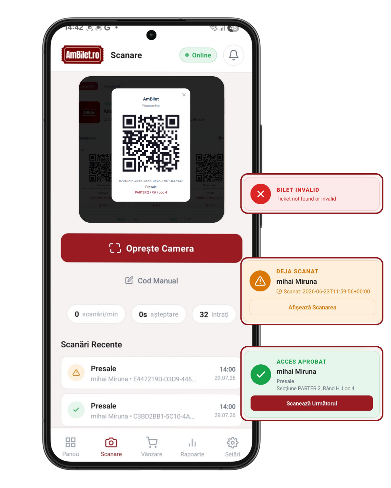

# Capitolul 9 — Scanarea cu camera

Metoda cea mai folosită la intrare: pui telefonul spre codul QR al
biletului, aplicația verifică automat.

Timp de citit: **~4 minute**.

---

## 1. Deschide tab-ul Scanare

Din meniul de jos, apasă **Scanare**. Prima dată:

- Aplicația **cere permisiunea camerei** — apasă „Permite"
- Vezi cadrul scanner-ului cu 4 colțuri roșii pulsante

<!-- SCREENSHOT: ecran Scanare cu cadrul scanner pulsând + camera activă -->

Deasupra cadrului sunt niște statistici:
- Total scanați la eveniment
- Rata (scanări / minut)
- Timp mediu între scanări

Sub cadru:
- Butoanele **Cod Manual** și **Pauzează**
- Lista **Scanări Recente** — istoricul tău (ultimele 10-20)

---

## 2. Cum scanezi

**Pointezi telefonul spre codul QR** al biletului. Cadrul detectează
automat — nu trebuie să apeși nimic.

**Sfaturi**:
- Ține telefonul la ~15-30 cm de bilet
- **Nu tremura** — mișcarea prea rapidă face codul illegibil
- În lumină slabă, folosește lanterna telefonului (buton pe unele
  device-uri, în bara de status)
- Codul poate fi și pe **hârtie tipărită**, nu doar pe ecran

**Detecție**: aplicația recunoaște automat:
- QR code
- Code 128
- Code 39
- EAN 13
- EAN 8

Deci merge și cu **coduri de bare** normale, nu doar QR.

---

## 3. Rezultatul scanării

După detecție, ecranul **flash briefly** cu o culoare + apare un card:

### 🟢 Verde — ACCES APROBAT

Bilet valid, prima intrare.

Cardul verde arată:
- **Numele** persoanei
- **Tipul biletului** (General, VIP)
- Dacă e cu loc: **Secțiune · Rând · Loc**
- Dacă e „extern" (achiziționat prin alt sistem): badge violet „Bilet extern"

<!-- SCREENSHOT: card verde ACCES APROBAT cu nume + tip + loc -->

### 🟡 Portocaliu — DEJA SCANAT

Biletul a fost scanat deja înainte.

Cardul portocaliu arată:
- **Numele** (dacă e disponibil)
- **Când s-a scanat** (ex. „Scanat: 20.07.26 · 14:32")

Util să știi când a intrat prima dată — dacă a fost recent, cere să
vadă biletul original / verifică actele.

<!-- SCREENSHOT: card portocaliu DEJA SCANAT cu timestamp -->

### 🔴 Roșu — BILET INVALID

Bilet inexistent, anulat, refundat sau blocat.

Cardul roșu arată:
- **Motivul** (ex. „Bilet neinvitat la acest eveniment", „Bilet anulat")

<!-- SCREENSHOT: card roșu BILET INVALID cu motiv -->

---

## 4. Feedback: sunet + vibrație + flash

Pentru fiecare rezultat, aplicația oferă și feedback non-vizual:

| Rezultat | Sunet | Vibrație | Flash color |
|---|---|---|---|
| 🟢 Aprobat | „ding" clar | scurtă | verde |
| 🟡 Duplicat | „warning" | dublă | portocaliu |
| 🔴 Invalid | „error" grav | triplă lungă | roșu |

Deci chiar dacă nu te uiți la ecran, îți dai seama după sunet ce s-a
întâmplat. Util în zgomot mare — vibrația și flash-ul ajung mereu.

**Poți dezactiva sunetul/vibrația** din Setări → Scanner
([cap. 24](./24_setari_scanner.md)).

---

## 5. Auto-clear

Cardul de rezultat rămâne pe ecran **~3 secunde**, apoi dispare
automat. Aplicația e gata să scaneze următorul.

Poți continua să scanezi fără să apeși nimic — camera rămâne activă.

---

## 6. Modul auto-confirm

Dacă activezi **Auto-confirmare Valide** din Setări, biletele valide se
scanează **fără să mai vezi cardul verde** — mai rapid, mai fluid.

Doar duplicatele și invalidele îți întrerup fluxul cu un card.

**Recomandat pentru evenimente cu multe intrări** și **cifre mari de
scanare pe minut**. Dezactivat automat pentru evenimente în viitor
(vezi [cap. 24](./24_setari_scanner.md)).

---

## 7. Butonul Pauzează

Sub cadrul scanner, butonul `Pauzează` oprește temporar camera. Util
când:

- Ai nevoie de o pauză (mâncare, apă)
- Vrei să-i arăți telefonul cuiva
- Vine o vizită la casă și nu vrei să scanezi accidental

Când e pausat, apare un overlay negru cu iconă mare `⏸` peste tot
ecranul.

Apasă `Reia` pentru a-l reactiva.

---

## 8. Ecranul „doar rapoarte" (evenimente trecute)

Dacă selectezi un **eveniment trecut**, tab-ul Scanare intră în modul
**„doar rapoarte"** — nu se poate scana (nu are sens, evenimentul s-a
încheiat), dar poți vedea toate statisticile de check-in.

Un banner roșu sus îți amintește: „Doar rapoarte — evenimentul s-a
încheiat".

---

## 9. Cod extern (nu QR)

Dacă clientul are un **cod tipărit** fără QR (doar text, ex.
„AMB-1234"), nu-l poți scana. Folosește **Cod Manual**
([cap. 10](./10_scanare_manuala.md)).

---

## 10. Probleme frecvente

**„Camera nu detectează codul"**
- Curăță lentila telefonului
- Verifică că e lumină suficientă (aprinde bec / lanternă)
- Ține telefonul mai aproape / mai departe (~20cm ideal)
- Verifică că codul biletului nu e mototolit / imprimat prost

**„Cere mereu permisiunea camerei"**
- Setări telefon → Aplicații → AmBilet → Permisiuni → Cameră →
  Permite mereu

**„Cadrul e negru, nu apare camera"**
- Închide app-ul complet (swipe out din recente), redeschide-l
- Verifică că altă app nu folosește camera (deschide/închide app-ul
  camera nativ)
- Reboot telefon dacă persistă

**„Codul se scanează dar rezultatul e mereu invalid"**
- Verifică că **ai selectat evenimentul corect** (bara roșie sus)
- Bilet dintr-un eveniment diferit → arată invalid pentru cel curent

---

## 11. Testează pe viu

Doar dacă ai un bilet de test la îndemână.

1. [**Deschide Scanare →**](app://navigate/CheckIn)
2. Permite accesul la cameră
3. Pointează spre codul QR al unui bilet
4. Vezi rezultatul (verde / portocaliu / roșu)
5. Ascultă sunetul + observă vibrația + flash-ul
6. Verifică că apare în „Scanări Recente" jos, cu timestamp

---

## Următorul capitol

📖 [Capitolul 10 — Scanarea manuală →](./10_scanare_manuala.md)

📚 [Cuprins →](./00_cuprins.md)
