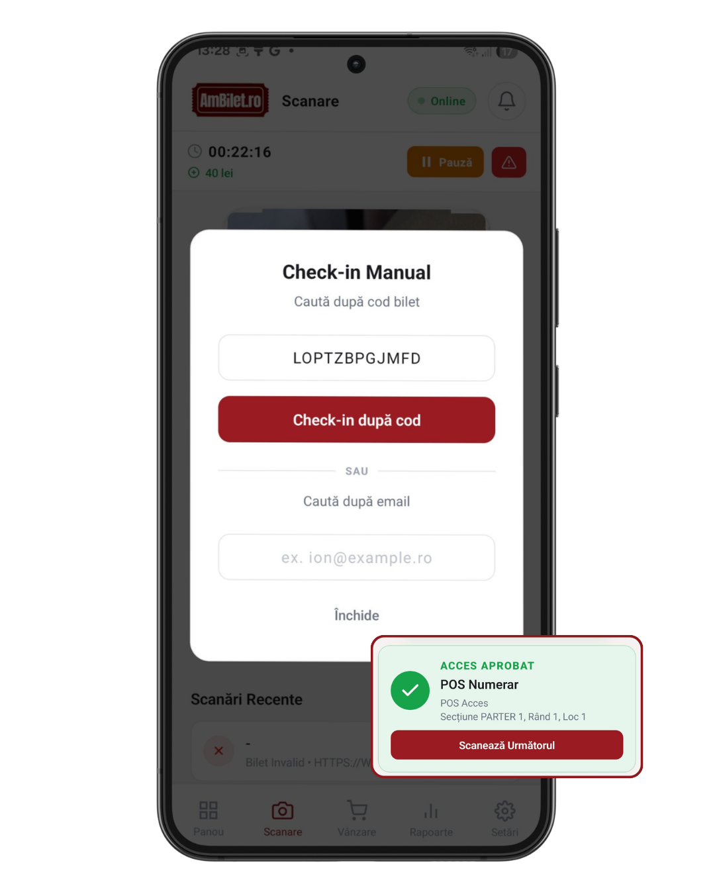

# Capitolul 10 — Scanarea manuală (cod sau nume)

Când camera nu poate scana (bilet șters, cod defect, client fără telefon), ai două soluții rapide: **tastezi codul** sau **cauți după nume**.

Timp de citit: **~3 minute**.

---

## 1. Deschide modalul

Din tab-ul **Scanare**, sub cadrul de scanner, apasă butonul **`Cod Manual`**.

Se deschide un modal cu **două căi** clare, despărțite de un „SAU":

<!-- SCREENSHOT: modal Check-in Manual cu 2 secțiuni + separator SAU -->

---

## 2. Calea 1 — introduci codul

Sus, câmp text **„Tastați codul biletului"**:

- Poți tasta direct codul (ex. `ABC123`)
- Poți lipi (paste) URL-ul de verificare (ex. `https://ambilet.ro/t/ABC123`)
- Poți lipi codul de bare copiat din alt sistem

**Cum funcționează**:
1. Tastează / lipești codul
2. Apasă butonul **`Check-in după cod`** de sub câmp
3. Aplicația face check-in-ul instant
4. Vezi același rezultat ca la scanare cu camera (verde/portocaliu/roșu)

**Sfat**: dacă biletul a fost trimis prin email, clientul poate să copieze codul din email și să-l trimită pe WhatsApp. Tu lipești direct.

---

## 3. Calea 2 — cauți după nume

Sub separatorul „SAU", al doilea câmp text **„ex. Ion Popescu"**:

**Cum funcționează**:
1. Tastează minim 2 caractere din numele participantului
2. Aplicația așteaptă puțin (0.3 secunde) și **caută automat** pe server
3. Apare o listă cu **până la 8 rezultate**

Fiecare rezultat arată:
- **Numele beneficiarului** sau al cumpărătorului
- **Tipul biletului · Codul**
- Buton **`Check-in →`** dacă e nevalidat
- Badge verde **`Scanat`** dacă e deja checked-in (buton dezactivat)

<!-- SCREENSHOT: modal cu search Ion + 3 rezultate + 1 badge Scanat -->

**Tap pe un rezultat** → check-in-ul se face instant, modalul se închide, vezi rezultatul.

---

## 4. Caz special — bilete deja scanate

Dacă un rezultat arată **`Scanat`** (badge verde), butonul de check-in e dezactivat — nu poți face duplicat accidental. Îți dai seama că persoana e deja înăuntru, deci probabil are un caz aparte:

- Vrea să iasă și să reintre? Contactează admin să reseteze scanarea
- E o eroare? Verifică pe [cap. 12 — Probleme scanare](./12_probleme_scanare.md)

---

## 5. Când folosești fiecare cale

**Alege cod** dacă:
- Ai codul scris pe hârtie / SMS / email
- Ai un URL de verificare (link din email)
- Vrei precizie maximă (fără dubii)

**Alege căutare nume** dacă:
- Clientul a pierdut / șters biletul
- Nu are telefon la el
- Are biletul pe numele altcuiva (părinte a cumpărat)
- Vrei să verifici rapid „sunt pe listă?"

---

## 6. Ambele căi funcționează pe același ecran

Poți încerca **întâi codul**, apoi (dacă nu-l ai) treci la nume. Nu trebuie să închizi și să redeschizi modalul.

---

## 7. Buton Închide

Jos, butonul `Închide` reia scanarea cu camera. Sau tap în afara modalului (pe zona întunecată) → același efect.

---

## 8. Limitări

- **Necesită internet** — atât pentru check-in (validare live) cât și pentru căutare nume (query server). Fără net, folosește modul
  offline check-in ([cap. 6 — vânzare offline](./06_vanzare_offline.md) descrie și cash-in offline)
- **Search caz-insensitiv, dar diacritice contează**: dacă cauți „Stefan", NU găsești „Ștefan". Încearcă ambele variante.
- **Caută în**: numele beneficiarului + numele cumpărătorului + emailul + codul biletului. Deci și „gmail.com" caută în email-uri.
- **Max 8 rezultate** afișate — dacă sunt mai mulți cu același nume, restrânge query-ul (adaugă prenume sau nume de familie)

---

## 9. Probleme frecvente

**„Am tastat codul, dar zice Invalid"**
- Verifică majusculele / literele confuze (0 vs O, 1 vs l, etc.)
- Verifică că evenimentul selectat sus e cel corect
- Verifică că biletul nu e anulat de admin

**„Căutarea după nume nu găsește nimic"**
- Așteaptă 1 secundă (debounce 300ms + latență server)
- Încearcă doar numele de familie sau doar prenumele
- Diacritice: „Stefan" ≠ „Ștefan", încearcă ambele
- Verifică evenimentul selectat

**„Găsesc omul, dar butonul Check-in e gri"**
- Deja checked-in (badge Scanat) — nu duplicat accidental
- Bilet cancelled / refunded

**„Nu se deschide modalul"**
- Verifică că nu ești în mod „pauză" al scanării
- Închide și redeschide tab-ul Scanare

---

## 10. Testează pe viu

1. [**Deschide Scanare →**](app://navigate/CheckIn)
2. Apasă `Cod Manual`
3. **Calea cod**: tastează un cod valid, apasă `Check-in după cod`
4. **Calea nume**: în al doilea câmp, tastează 2-3 litere din numele unei persoane pe care știi că e pe listă
5. Vezi rezultatele apărând după ~0.3s
6. Tap pe unul → check-in-ul se execută
7. Închide cu `Închide`

---

## Următorul capitol

📖 [Capitolul 11 — Scanere Bluetooth externe →](./11_scanere_bluetooth.md)

📚 [Cuprins →](./00_cuprins.md)
