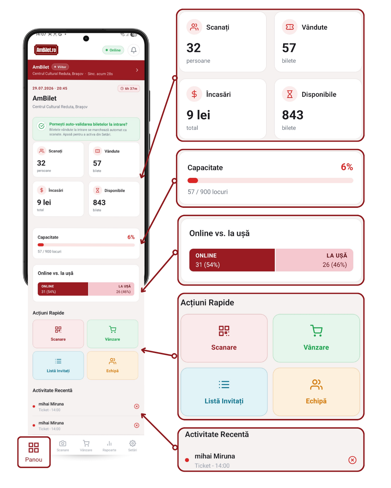

# Capitolul 13 — Panoul de control

**Panou** e ecranul-tablou de bord: toate cifrele importante ale
evenimentului tău, într-un singur loc. Fiecare card e clickabil pentru
detalii.

Timp de citit: **~5 minute**.

---

## 1. Ce vezi pe Panou (de sus în jos)

- **Bara evenimentului** (roșie) — care eveniment e activ
- **Dacă e azi/live**: un prompt verde te întreabă dacă vrei să activezi
  auto-validarea biletelor
- **Grid cu 4 cifre-cheie**: Scanați / Vândute / Încasări / Disponibile
- **Capacitate** — bară de progres a stocului
- **Ritm vânzare** — dacă ai deja vânzări azi
- **Online vs. la ușă** — split cumpărări
- **Acțiuni Rapide** — 4 shortcut-uri
- **Activitate recentă** — ultimele check-in-uri
- Buton **Închide tura** (dacă tura e pornită)

<!-- SCREENSHOT: Panoul complet, scroll de sus până jos -->

---

## 2. Cele 4 carduri mari

Grid 2×2 în partea superioară:

### 📱 Scanați

- **Cifra mare**: câți oameni au intrat până acum
- **Sub-text**: „persoane"
- **Tap** → deschide modalul Listă Invitați ([cap. 20](./20_notificari.md))

### 🎫 Vândute

- **Cifra mare**: total bilete vândute la eveniment
- **Sub-text**: „bilete"
- **Tap** → deschide modalul cu **breakdown per tip de bilet** (câte
  General, câte VIP, etc.)

### 💰 Încasări

- **Cifra mare**: suma totală încasată (format RON)
- **Sub-text**: „total"
- **Tap** → deschide modalul cu detalii de venituri (online + POS,
  breakdown per metodă plată)

### ⏳ Disponibile

- **Cifra mare**: bilete rămase pe stoc
- **Sub-text**: „bilete"
- **Tap** → deschide modalul cu **rămase per tip** (câte General mai
  sunt, câte VIP, etc.)

<!-- SCREENSHOT: cele 4 carduri cu cifre reale + iconițe roșii -->

**Notă**: dacă un eveniment n-are capacitate configurată, „Disponibile"
arată `—` și cardul nu e clickabil.

---

## 3. Card Capacitate

O secțiune separată sub grid:

- Titlu: **„Capacitate"** + procent (ex. „67%")
- **Bară de progres** verde care se umple pe măsură ce vinzi
- Text sub bară: „X vândute / Y total locuri"

Dacă evenimentul e fără capacitate limitată, cardul nu apare.

<!-- SCREENSHOT: bară capacitate 67% cu 402 vândute / 600 total -->

---

## 4. Ritm vânzare (dacă ai vânzări)

Card apare doar după prima ta vânzare pe device-ul curent. Descris în
detaliu în [capitolul 14](./14_ritm_vanzare.md).

---

## 5. Online vs. la ușă

Secțiune cu **bară stacked** care arată proporția:

- **Segment roșu Online** — bilete cumpărate pe website
- **Segment roz La ușă** — bilete vândute prin app (POS)

Fiecare segment arată numărul și procentul.

<!-- SCREENSHOT: bară Online vs La ușă cu 1086 (73%) online + 400 (27%) ușă -->

**Tap pe un segment** → se **expandează sub bară** o listă cu tipurile
de bilete vândute pe canalul respectiv. Al doilea tap pe același
segment → colapsează.

Util să vezi „care tip de bilete se vinde mai bine la ușă vs. online".

---

## 6. Acțiuni Rapide

4 butoane mari, grid 2×2:

| Buton | Culoare | Ce face |
|---|---|---|
| **Scanare** | roșu | Sare la tab-ul Scanare |
| **Vânzare** | verde | Sare la tab-ul Vânzare |
| **Listă Invitați** | cyan | Deschide modalul cu invitații |
| **Echipă** | portocaliu | Deschide modalul cu personal |

<!-- SCREENSHOT: 4 butoane acțiuni rapide colorate distinct -->

Alternativă la meniul de jos — util să sari direct la ce ai nevoie.

---

## 7. Activitate Recentă

O listă cu **ultimele 10 activități**:

- Iconă verde/roșie pentru status
- **Numele persoanei** + **tipul biletului**
- **Momentul** (ex. „acum 12 min")
- Iconă bifă (verde) sau X (roșu)

Include check-in-uri și scanări invalide.

**Long-press pe un rând** → copiază codul biletului în clipboard (util
să-l trimiți colegului pe WhatsApp).

<!-- SCREENSHOT: listă activitate recentă cu 3 rânduri + long-press context -->

---

## 8. Închide Tura (dacă e pornită)

Jos de tot, buton roșu **`Închide tura`** care oprește tura curentă.
Vezi [capitolul 21](./21_tura.md).

---

## 9. Auto-refresh

Panoul se **reîmprospătează automat** la fiecare 30 secunde. Vezi
cifrele mereu la zi fără să apeși nimic.

**Pull-to-refresh**: trage ecranul în jos → refresh forțat imediat.

---

## 10. Ce se sincronizează în timp real

- Vânzări proaspete (WebSocket instant)
- Scanări (WebSocket instant)
- Rambursări / cancelări (WebSocket)

Deci dacă alt casier de la altă intrare face un scan, îl vezi apărând
în Activitate Recentă în ~1-2 secunde.

---

## 11. Panoul pentru scanner (staff simplu)

Dacă ești logat ca **staff scanner** (nu admin), Panoul arată diferit:

- Fără cele 4 carduri mari (nu vezi vânzări / venituri)
- În loc: **Încasări (din tura ta)** — cash + card
- **Statistici personale**: câte scanuri, câte vânzări ai făcut tu
- Butoane mari **Scanare** și **Vânzare**

<!-- SCREENSHOT: Panoul redus pentru staff scanner, cu statistici tură -->

Nu vezi cifrele altor casieri sau totalurile globale ale evenimentului.

---

## 12. Sincronizare — indicator „Sinc. acum X"

Sub numele evenimentului, bara roșie afișează un timestamp discret:
**„Sinc. acum 5s"** sau **„Sinc. acum 2m"**.

Îți spune **cât de proaspăt** e ce vezi. Dacă zice „acum 5s", cifrele
sunt live. Dacă zice „acum 15m", refresh manual (pull-to-refresh).

---

## 13. Probleme frecvente

**„Cifrele arată diferit de ce văd în admin web"**
- Cache pe device — trage în jos (refresh)
- Alte cifre: web-admin poate include date filtrate diferit (ex. cu/fără
  test)

**„Am doar Scanați, nu văd Vândute / Încasări"**
- Ești logat ca staff scanner, nu admin. Rolul îți limitează vederea.

**„Cardul Disponibile arată `—`"**
- Evenimentul nu are capacitate configurată. Cere admin să o seteze
  din web-admin.

**„Ritm vânzare nu apare"**
- Nu ai făcut încă nicio vânzare **de pe acest device**. Cardul se
  activează după prima vânzare a ta.

---

## 14. Testează pe viu

1. [**Deschide Panoul →**](app://navigate/Dashboard)
2. Verifică bara roșie sus + indicatorul sync (acum Xs)
3. Tap pe cardul **Vândute** → vezi break-down per tip
4. Închide modal → tap pe cardul **Încasări** → detalii venituri
5. Tap pe **Online** din bara „Online vs. la ușă" → vezi lista
6. Trage Panoul în jos → refresh forțat, sync-ul arată „acum"

---

## Următorul capitol

📖 [Capitolul 14 — Ritmul vânzărilor →](./14_ritm_vanzare.md)

📚 [Cuprins →](./00_cuprins.md)
